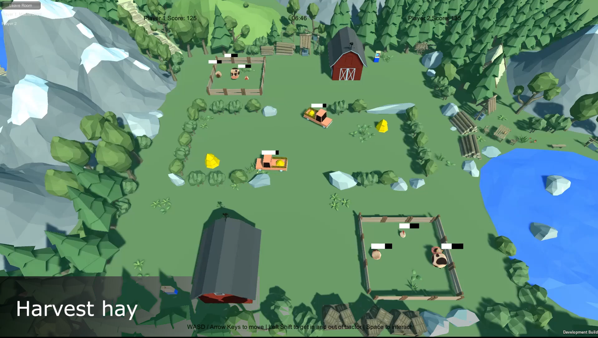

# Haystack Hoarder

Made with Unity (2019.2.13f1) and Photon Networking. Inspired by Vincent Van Gogh's "Haystacks in Provence."

Haystack Hoarder puts your decision making, time management, and reaction speed to the test as you scramble to feed your hungry animals. Two to four players at a time are packed in one field, running back and forth between their farms and the haystacks in the middle field. Compete against others and wreak havoc on the other players' farms!

Feeding your animals is a four-step task! First, you must drive to the hayfields in your trusty tractor, which you must keep consistently fueled. Then, gather as much hay as possible with your tractor, bring it to the barn to be processed into feed, and give the food to the animals in your pens. 

Watch out because other players are trying to gather hay for their animals too, and there are only a few haystacks shared between farms. Scramble to grab hay before the other players or sabotage their farms to slow down your competition. Steal their fuel, steal their hay, and even break down their fences to let their animals escape, but watch out for your own!

# Features

-Networking using Pun2 to create rooms to synchronize players. Once all players join a room, the owner of the room can start the session which loads the map and begins the match. Photon also tracks the state of players (holding an item or not), the animals' meters and what player they belong to, the health of each players' fences, and the state of haystacks, barns, and player tractors.

-Animal AI. Animals stay calm while in a pen. If a fence breaks, the animal will try to escape and will run away from players that move towards them. Chickens constantly move around the map and avoid players; sheep run as far away from the player as possible; and cows stay stationary as long as the player is not too close.

-UI system to display which player currently is the leader. It displays player's points; meters to show each animal's happiness; how much fuel is in tractor; progress of turning hay into bale over the barn; progress of harvesting hay from haystacks; and progress of fixing and breaking fences.

-Sound effects and animation for different player's actions.

-Additional player actions and sabotage methods are listed below.

# How To Play

-Use WASD keys to move.

-Use the left shift key to get in and out of the tractor.

-Hold space while in the tractor to harvest hay.

-Unload harvested hay from the tractor by pressing space and then press space to put it into the
barn to process hay into bale.

-Bring the bale towards one of your animals and press space to feed animals.

-Approach your fuel station and press space to get a gas can. Bring it to your tractor and press space again to refill the tractor's fuel.

-Keep animal's meter full by feeding them to get bonus points.

-Fences break down over time. Move next to a fence and press space to fix the fence. If it breaks, your animals will try to escape. Approach them and press space to collect them and press space to release them into your pen.

-Approach an opponent's fence and hold space to break your opponent's fences.

-Steal opponents' animals by breaking their fences and collecting their animals back to your pen.

-Approach an opponent's barn and press space to steal their hay or bale.

-Approach an opponent's tractor and press space to drain their fuel.

-Move to an opponent and press space to stop them from performing any sabotage methods.

